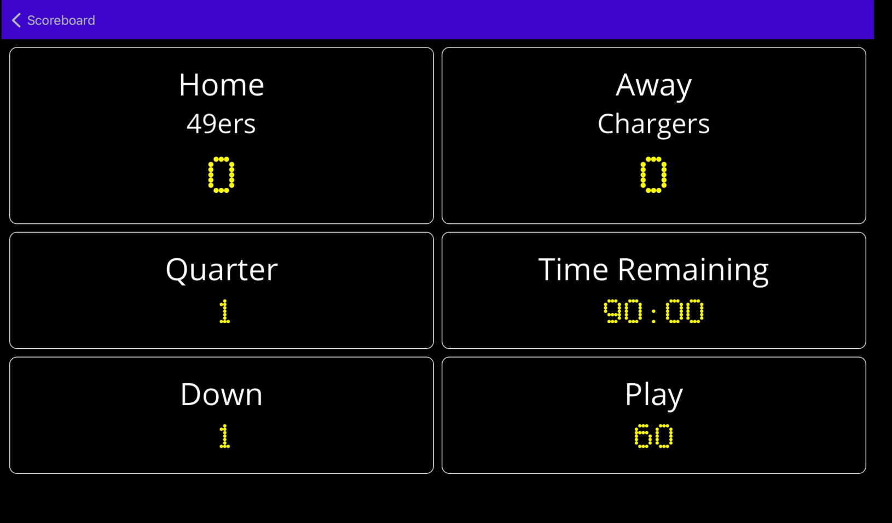
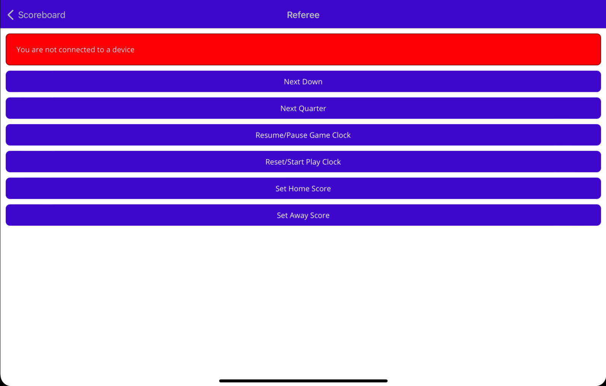
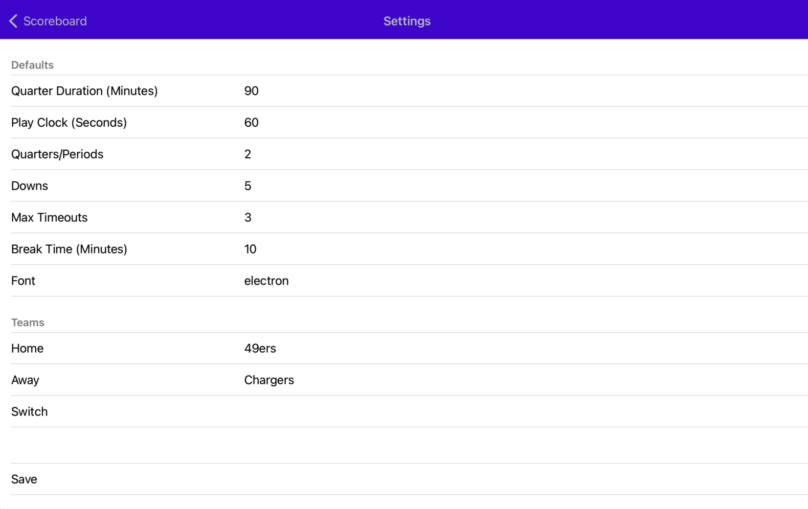

# Digital Scoreboard

A football scoreboard that can be controlled through Bluetooth.  Great for little league games.

## Features
* Referee "client" screen that allows you to control the scoreboard remotely
* Customized Team Names
* Customized Game & Play Clock Timers
* Full Screen Clock for Half Time or Play Clock
* Screen Properties
    * Current quarter/period
    * Current Down
    * Play Clock
    * Game Clock
    * Timeouts Remaining
    * Ball Possession
    * Yards-To-Go

## The "Stack"

* .NET MAUI
* Prism
* ReactiveUI
* Shiny (BluetoothLE & BluetoothLE Hosting)
* Shiny.Framework (brings together Shiny, Prism, & ReactiveUI in a tidy little bundle)

## Scoreboard
This screen is meant for tablets in landscape view.  It sets up a bluetooth LE host using Shiny.BluetoothLE.Hosting that can allow connections to control the scoreboard clocks and scores

You can also control most settings, pause/resume of clocks, etc by tapping on the screen.  This is a good option if you don't have a tablet and a phone to remote control with or if bluetooth distance is a problem.

## Referee

Uses Shiny.BluetoothLE to connect to the scoreboard host.

## Settings

The settings screen allows you to set all of the scoreboard constraints and others things like team names

## TODO

* Play clock start/resets send command /w settings value to ref - ref runs own timer
* Period clock start/stop command /w current value to ref - ref runs own timer
* Move possession indicator to be a mini football beside team name or score
* Full Screen Label Font on timer screen
* Load/Save Rulesets in settings
* Online Error Log - AppCenter, Firebase, Sentry, etc
* Ball On Yard
* Remove Referee Screen
    * You connect to scoreboard or host a scoreboard - you can also just have a scoreboard with no connections
* Setting to auto remember "scoreboard"?
* Client can tell remote scoreboard to go to fullscreen play clock or timer

## FUTURE?

* Close to Football Scoreboard
    * Hockey
        * Shots on Goal per team 
        * Penalty Time Remaining (2 per team)
    * Basketball
        * Fouls
        * Shot Clock
    * Soccer
        * Shots per team
        * Saves per team
        * Penalty Time Remaining (2 per team)

* Way Different
    * Curling
        * Ends
        * Who starts
        * Points per end?
    * Baseball
        * Top/Bottom of Inning
        * Inning Scores
        * Balls
        * Strikes
        * Outs
        * Errors
        * Hits
    * Tennis
        * Games & Sets
        * Scoring 0, 15, 30, 40, Tie, Adv
        * Set Points